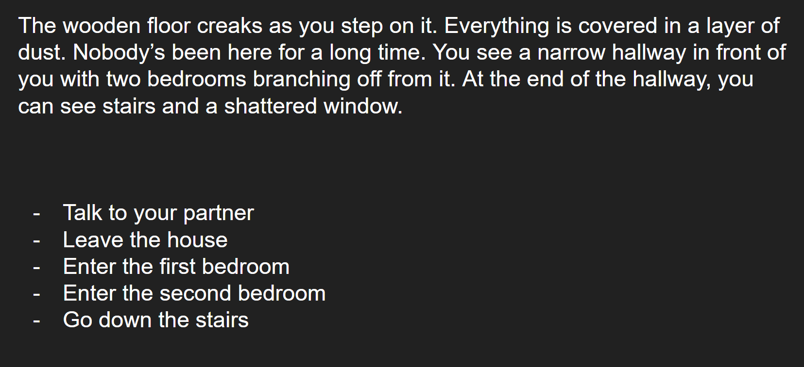

# Mysterious Game

Author: Vishant Raajkumar

Design: A mysterious detective game that's so mysterious, it doesn't even work. It prints out some text, leaving you to decipher the clue.

Text Drawing: The text drawing does not work. Currently, I have some code in [file](text_process.cpp) that's taken from a Harfbuzz tutorial and all it does is process some fixed text, but it does not draw it.

Choices: It does not store any choices or narrative. There is currently a single string in [file](text_process.cpp) that doesn't have any story for the game but it does have the story of my life.

Screen Shot:

How To Play:

Read the printed text and try to make sense of it all.

Sources: [link](https://fonts.google.com/specimen/Open+Sans)

This game was built with [NEST](NEST.md).

